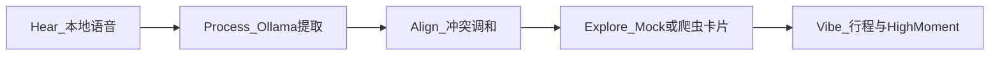
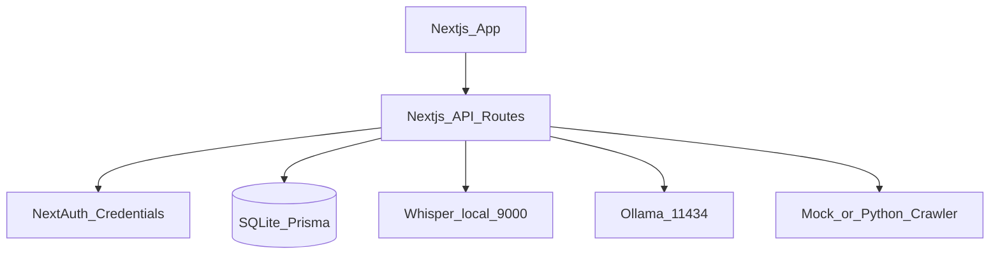

# HearHere / 听见：0→1 开发计划（本地化 V1.0 · 最新）

## 已拍板的产品与技术决策

| 维度 | 决策 |
|------|------|
| **部署形态** | 全栈本地运行，不使用 Clerk / Supabase / OpenAI / Tavily 等云端服务 |
| **认证** | NextAuth.js，`CredentialsProvider`，用户数据存 **SQLite** |
| **用户同步** | **注册即创建**：注册或首次登录成功后，立即在 SQLite 写入 `User` 记录 |
| **数据库** | SQLite + Prisma（[`development.md`](PRDs/development.md) 需同步改回本地化 Schema，见 M0） |
| **AI** | 本地 **Ollama**（NLU/规划/文案）+ 本地 **Whisper**（ASR，如 `localhost:9000`） |
| **Insight Hub** | MVP：**Mock JSON** 或调用你本地 **Python 爬虫** HTTP 接口；不接第三方搜索 API |
| **语言** | 仅 **简体中文**（Prompt、UI、Mock 数据） |
| **歌单** | 仅 **视觉参考**（封面/文案），**不实现真实播放** |
| **地图** | **V1 不做**，聚焦语音 + 行程卡片 |
| **成本** | 本地推理，**不做 API 配额/计费** 设计 |

> 说明：仓库内 [`PRDs/PRD.md`](PRDs/PRD.md)、[`PRDs/development.md`](PRDs/development.md) 仍部分写着云服务栈，**开工 M0 时应先按本计划回写 PRD §4 与 development 全文**，避免实现与文档分叉。

---

## MVP 成功标准（可演示闭环）

完成 **HearHere Loop** 一条路径（[`PRD.md`](PRDs/PRD.md) §2）：



- 登录用户 → 首页录音 → 标签云确认 →（多人）调和方案 → Tinder 选点 → 生成行程页（拍立得 High Moment + 氛围色 + 歌单视觉块，无播放）

---

## 系统架构（本地化）



| 层级 | 选型 |
|------|------|
| 前端 | Next.js 14+ App Router、Tailwind、Shadcn UI、Framer Motion、Zustand、Lucide |
| 后端 | Route Handlers / Server Actions |
| 数据 | Prisma + SQLite `file:./dev.db` |
| 认证 | NextAuth Credentials + `bcrypt` 密码哈希 |
| ASR | 本地 Whisper 服务（服务端代理，浏览器不直连） |
| LLM | Ollama（推荐 `qwen2.5:7b` 等中文友好模型） |
| 情报 | `INSIGHT_SOURCE=mock` \| `crawler`，爬虫 URL 可配置如 `http://localhost:8000` |

---

## 里程碑 M0–M6（含文档回查）

### M0 — 项目与数据基座（当前优先）

**交付物**

- `hearhere/`（或你指定的根目录）Next.js 14 工程：TypeScript、Tailwind、ESLint、App Router
- 依赖：`lucide-react`、`framer-motion`、`clsx`、`tailwind-merge`、Shadcn 初始化
- Prisma + SQLite：按本地化 Schema 迁移生成 `dev.db`
- NextAuth：注册页、登录页、`/api/auth/[...nextauth]`
- **注册即创建**：`signUp` 成功 → `prisma.user.create`；登录校验 `username` + `password`
- `.env.example`：`DATABASE_URL`、`NEXTAUTH_SECRET`、`WHISPER_URL`、`OLLAMA_URL`、`INSIGHT_SOURCE`、`CRAWLER_URL`
- 健康检查页或 API：`/api/health` 探测 Ollama/Whisper 是否在线（可选）

**做完请复查**

| 主题 | 文档 |
|------|------|
| 本地化架构、Prisma 模型 | [`development.md`](PRDs/development.md) §1–3（需改为 SQLite + username/password User） |
| 技术栈清单 | [`development.md`](PRDs/development.md) §2 |
| M0 执行顺序 | [`development.md`](PRDs/development.md) §5 阶段一 |

**Prisma 模型要点（本地化）**

```prisma
model User {
  id        String   @id @default(cuid())
  username  String   @unique
  password  String   // bcrypt
  trips     Trip[]
}
// Trip / Moment / DayPlan 与 development 本地化版一致
```

---

### M1 — 设计系统与壳层 UI

**交付物**

- 全局主题：[`UI.md`](PRDs/UI.md) §2.1 色板（`#FBF9F7` 底、`#2D2E30` 主字、Vibe Glows）
- 毛玻璃卡片基类：§2.2 `backdrop-blur-md`、`border-white/20`、浅长阴影
- 字体：Inter/Geist + 中文标题；High Moment 预留 Noto Serif SC
- Mesh 渐变背景 + 布局壳（顶栏 slogan：「在这里听见你的需求」）
- Zustand store 骨架：`sessionDraft`（语音转写、标签、选中卡片）
- 路由骨架：`/` 倾听、`/confirm` 标签云、`/explore` 卡片、`/trip/[id]` 行程（可先空页）

**做完请复查**

| 主题 | 文档 |
|------|------|
| Silk & Light 理念 | [`UI.md`](PRDs/UI.md) §1 |
| 色彩/材质/字体 | [`UI.md`](PRDs/UI.md) §2 |
| 组件栈 | [`UI.md`](PRDs/UI.md) §4 |
| 极简与动效原则 | [`PRD.md`](PRDs/PRD.md) §5 |

---

### M2 — 倾听 + 理解（Whisper + Ollama + 标签云）

**交付物**

- 首页呼吸录音钮（[`UI.md`](PRDs/UI.md) §3.1：三层光圈、Framer pulse）
- `POST /api/asr`：上传音频 → 本地 Whisper → 返回 `text`
- `POST /api/extract`：Ollama 输出 **严格 JSON**（目的地、人数、偏好、约束、冲突点）
- 确认页标签云（§3.2）：胶囊标签、可编辑、可继续录音补充
- 所有 Prompt 与 UI 文案：**简体中文**

**做完请复查**：[`PRD.md`](PRDs/PRD.md) §3.1 · [`development.md`](PRDs/development.md) §4.1–4.2 · [`UI.md`](PRDs/UI.md) §3.1–3.2

---

### M3 — 对齐（Harmony Engine）

**交付物**

- 检测多人/团体模式（如「三个人去」）→ Ollama 生成冲突点与「最大公约数」草案
- 与标签云联动：用户改标签后可重新 `POST /api/harmony`
- 展示调和摘要（时间线交替、复合型地点等，对齐 PRD 示例）

**做完请复查**：[`PRD.md`](PRDs/PRD.md) §3.2 · [`development.md`](PRDs/development.md) §4.2

---

### M4 — 探索（Insight Hub：Mock / 爬虫）

**交付物**

- 抽象 `getInsightCards(intent)`：`mock` 读 `data/mock-insights.json`；`crawler` 调本地 Python 服务
- 卡片字段：标题、评价摘要、推荐理由、图片 URL（[`PRD.md`](PRDs/PRD.md) §3.3）
- Tinder 交互：左滑弃、右滑加入候选（Framer Motion，[`UI.md`](PRDs/UI.md) §3.3）
- Ollama 可将爬虫原始结果清洗为统一 JSON（可选第二步）

**做完请复查**：[`PRD.md`](PRDs/PRD.md) §3.3 · [`development.md`](PRDs/development.md) 本地化「搜索辅助」章节

**不做**：Tavily、任何云端搜索 API

---

### M5 — 呈现（行程 + Vibe + 持久化）

**交付物**

- 写入 `Trip` / `DayPlan` / `Moment`（关联当前登录 `userId`）
- Ollama 生成行程与 **High Moment** 感性文案（中文）
- 行程页：垂直时间线 + 拍立得模块（[`UI.md`](PRDs/UI.md) §3.3）
- 目的地驱动 **氛围光晕**（海滨/山林/黄昏等，§2.1）
- **歌单区块**：静态封面 + `musicHint` 文案，**无 audio 元素 / 无 embed**
- **不含地图组件**

**做完请复查**：[`PRD.md`](PRDs/PRD.md) §3.4 · [`development.md`](PRDs/development.md) §3 · [`UI.md`](PRDs/UI.md) §2.3、§3.3

---

### M6 — 联调与本地运行文档

**交付物**

- `README`：启动顺序（`ollama serve` → Whisper Docker/脚本 → `npm run dev` → 可选爬虫）
- 错误边界：Whisper/Ollama 离线时的友好中文提示
- 手测清单：注册 → 登录 → 语音 → 标签 → 卡片 → 保存行程
- 预置图库或 Mock 图片路径（[`development.md`](PRDs/development.md) 本地化图片策略）

**不做**：API 配额、云端部署、Clerk/Tavily 相关配置

---

## M0–M1 任务清单（立即执行项）

### M0

1. `create-next-app` + Tailwind + TypeScript + App Router  
2. 安装并配置 Shadcn UI、Framer Motion、Zustand  
3. `prisma init` → SQLite Schema → `prisma migrate dev`  
4. NextAuth Credentials：注册 API + 登录 + Session  
5. **注册即创建** `User`（`hooks` 或注册 route 内 `prisma.user.create`）  
6. `.env.example` + 中间件保护 `/confirm`、`/explore`、`/trip`  
7. **同步更新** [`PRDs/development.md`](PRDs/development.md) 与 [`PRDs/PRD.md`](PRDs/PRD.md) §4 为本地化表述  

### M1

1. `globals.css` + Tailwind 设计令牌（羊皮纸底、炭灰字、Vibe 变量）  
2. `GlassCard`、`MeshBackground` 组件  
3. `app/layout.tsx` 字体与 slogan  
4. 空路由页面 + 导航占位  
5. `stores/session.ts`（Zustand）  

---

## 本地服务约定（实现时默认）

| 服务 | 默认地址 | 用途 |
|------|----------|------|
| Whisper ASR | `http://localhost:9000/asr` | 语音转写 |
| Ollama | `http://localhost:11434/api/generate` | 提取 / 调和 / 行程 / High Moment |
| Python 爬虫（可选） | `http://localhost:8000/...` | Insight Hub 真实数据；未启动则回退 Mock |

---

## 文档维护提醒

执行任何里程碑前，先确认三份 PRD 与本文一致：

1. **产品逻辑** → [`PRD.md`](PRDs/PRD.md) §2–3  
2. **接口与本地 AI** → [`development.md`](PRDs/development.md) §1、§4、§5  
3. **界面** → [`UI.md`](PRDs/UI.md) §2–3  

---

## 后续可选（V1 之后）

- Insight Hub 稳定对接你的 Python 爬虫协议  
- 离线地图（Leaflet + 公共瓦片）  
- 歌单外链跳转（仍不内嵌播放器）  
- 预置城市图库扩充  
